# EDUGraphAPI - Office 365 Education Code Sample#

## What is EDUGraphAPI?##

EDUGraphAPI  is a sample that demonstrates:

* Linking local user accounts and Office 365 user accounts. 
* Calling Graph APIs, including:

  * [Microsoft Azure Active Directory Graph API](https://www.nuget.org/packages/Microsoft.Azure.ActiveDirectory.GraphClient/)
  * [Microsoft Graph API](https://www.nuget.org/packages/Microsoft.Graph/)

  After linking accounts, users can use either local or Office 365 accounts to log into the sample web site and use it.

* Get and show schools/sections/teachers/students from Office 365 Education:

  * [Office 365 Schools REST API reference](https://msdn.microsoft.com/office/office365/api/school-rest-operations)

  A [Differential query](https://msdn.microsoft.com/en-us/library/azure/ad/graph/howto/azure-ad-graph-api-differential-query) is used to sync data that is cached in a local database.

EDUGraphAPI is based on ASP.NET MVC. [ASP.NET Identity](https://www.asp.net/identity) is used in this project.

## How To: Configure your Development Environment

Download and install the following tools to run, build and/or develop this application locally.

- [Visual Studio 2015 Community](https://go.microsoft.com/fwlink/?LinkId=691978&clcid=0x409)

**GitHub Authorization**

1. Generate Token

   - Open https://github.com/settings/tokens in your web browser.
   - Sign into your GitHub account where you forked this repository.
   - Click **Generate Token**
   - Enter a value in the **Token description** text box
   - Select all the **check boxes**

   

   - Click **Generate token**
   - Copy the token

2. Add the GitHub Token to Azure in the Azure Resource Explorer

   - Open https://resources.azure.com/providers/Microsoft.Web/sourcecontrols/GitHub in your web browser.
   - Log in with your Azure account.
   - Selected the correct Azure subscription.
   - Select **Read/Write** mode.
   - Click **Edit**.
   - Paste the token into the **token parameter**.

   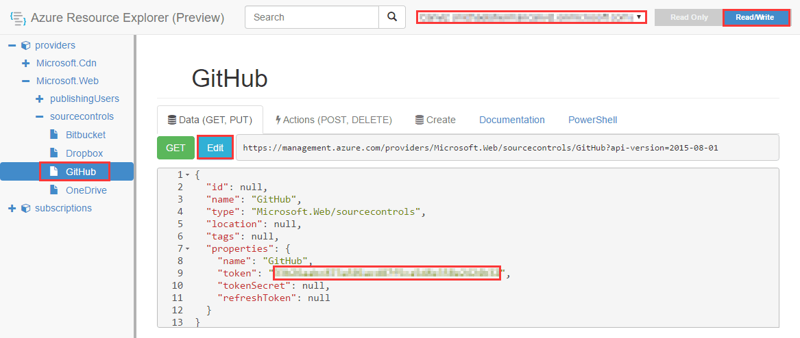

   - Click **PUT**

**Create a key to use the Bing Maps**

1. Open [https://www.bingmapsportal.com/](https://www.bingmapsportal.com/) in your web browser and sign in.

2. Click  **My account** -> **My keys**.

3. Create a **Basic** key, select **Public website** as the application type.

4. Copy the **Key** and save it. 

   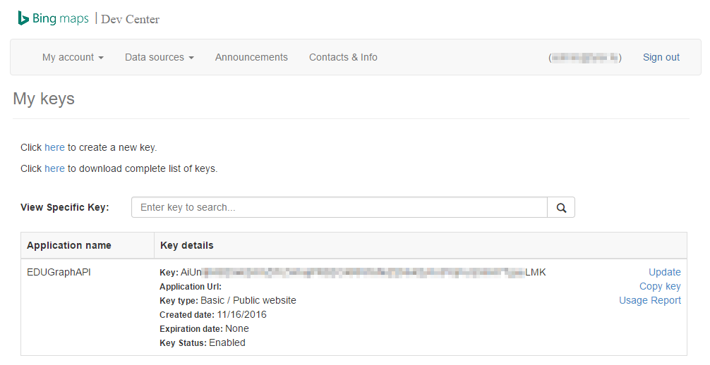

   >**Note:** The key is used in a subsequent step.

**Create an Application in you AAD**

1. Sign into [https://manage.windowsazure.com](https://manage.windowsazure.com).

2. Open the AAD where you plan to create the application.

3. Click **ADD** on the bottom bar.

   

4. Click **Add an application my organization is developing**.

   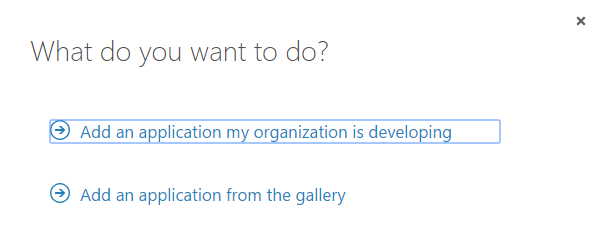

5. Input a **Name**, and select **WEB APPLICATION AND/OR WEB API**. 

   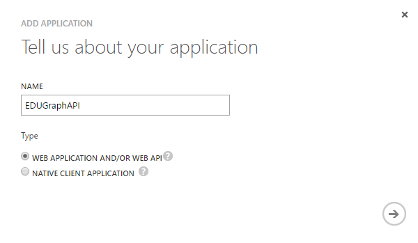

6. Click **->**.

7. Enter the following values:

   * **SIGN-ON URL:** https://localhost:44311/

   * **APP ID URI:** https://<<YOUR TENANT>>/EDUGraphAPI

   >**Note**: A domain from your tenant must be used here, since this is a multi-tenant application.

   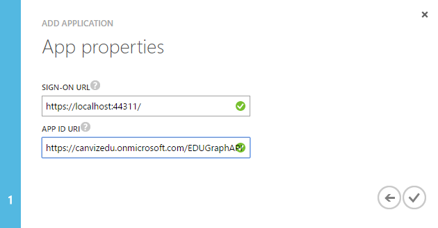

8. Click the **✓**.

9. Click **CONFIGURE**.

   

10. Enable **APPLICATION IS MULTI-TENANT**.

   

11. Configure the following **permissions to other applications**.

|                                | Application Permissions       | Delegated Permissions                    |
| ------------------------------ | ----------------------------- | ---------------------------------------- |
| Windows Azure Active Directory | Read and write directory data | Sign in and read user profile Read and write directory data |
| Microsoft Graph                | *None*                        | Read all groups Read directory data Access directory as the signed in user Sign user in |

12. In the keys section, click the dropdown list and select a duration, then click **Save**.

   

13. Copy the client id and save it.

   

	>**Note:** The client id is used in a subsequent step.

**Deploy the Azure Components**

1. Check to ensure that the build is passing VSTS Build

2. Fork this repository to your GitHub account

3. Click the Deploy to Azure Button

   

4. Fill in the values in the deployment page and select the **I agree to the terms and conditions stated above** checkbox.

   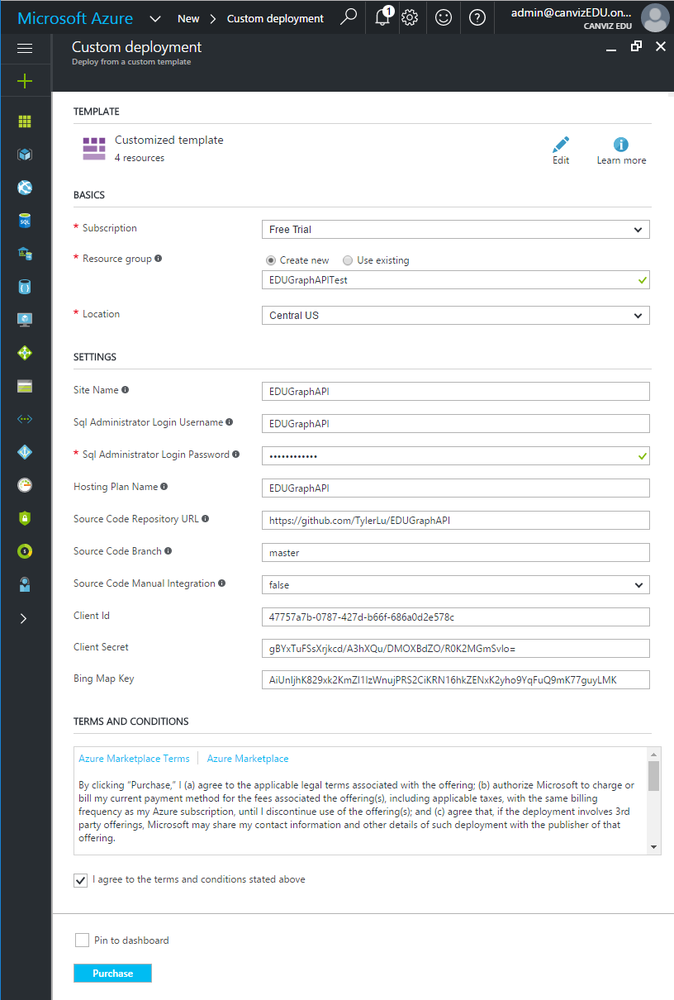

5. Click **Purchase**.

## Documentation

### Introduction

**EDUGraphAPI.Web**

This web project is base on a ASP.NET MVC application with the **Individual User Accounts** selected. 

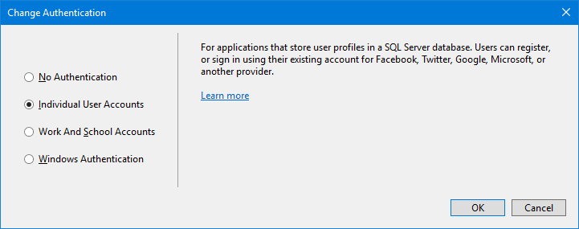

The following files were created by the MVC template, and we only change them a little bit.

1. **/App_Start/Startup.Auth.Identity.cs** (The original name is Startup.Auth.cs)
2. **/Controllers/AccountController.cs**

This sample project uses [ASP.NET Identity](https://www.asp.net/identity) and [Owin](https://docs.microsoft.com/en-us/aspnet/core/fundamentals/owin). The 2 technologies make different kinds of authentication coexist easily. Please get familiar them first.

Below are the important class files used in this web project:

| File                              | Description                              |
| --------------------------------- | ---------------------------------------- |
| /App_Start/Startup.Auth.AAD.cs    | Integrates with Azure Active Directory authentication |
| /Controllers/AdminController.cs   | Contains the administrative actions      |
| /Controllers/LinkController.cs    | Contains the actions to link user accounts |
| /Conrrollers/SchoolsController.cs | Contains the actions to show school data |

**EDUGraphAPI.SyncData**

This is the WebJob used to sync user data.

**EDUGraphAPI.Common**

The class library project is used both the **EDUGraphAPI.Web** and **EDUGraphAPI.Common**. 

The table below shows the folders in the project:

| Folder             | Description                              |
| ------------------ | ---------------------------------------- |
| /Data              | Contains ApplicationDbContext and entity classes |
| /DataSync          | Contains the UserSyncSerextensionsvice class which is used in the EDUGraphAPI.SyncData WebJob |
| /DifferentialQuery | Contains the DifferentialQueryService class which is used to send differential query and parse the result. |
| /Extensions        | Contains lots of extension methods which simplify coding the make code easy to read |
| /Utils             | Contains the wide used class AuthenticationHelper.cs |

**Microsoft.Education**

This project encapsulates the [Schools REST API](https://msdn.microsoft.com/en-us/office/office365/api/school-rest-operations). The most important class in this project is EducationServiceClient.

### Database

**ApplicationUsers**

| Column | Description |
| ------ | ----------- |
|        |             |
|        |             |
|        |             |
|        |             |

**ApplicationRoles**

**Organizations**

### Authentication flows

There are 4 authentication flows in this project.

The first 2 flows enable users to login in with either a local account or an Office 365 account, then link to the other account.

**Local Login Authentication Flow**

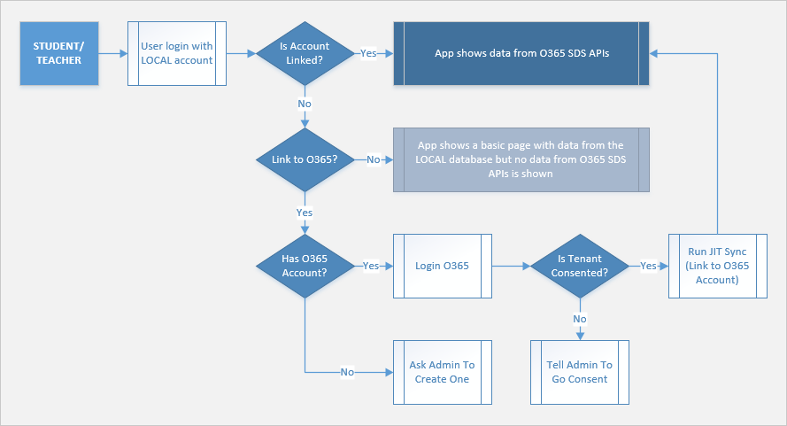

**O365 Login Authentication Flow**

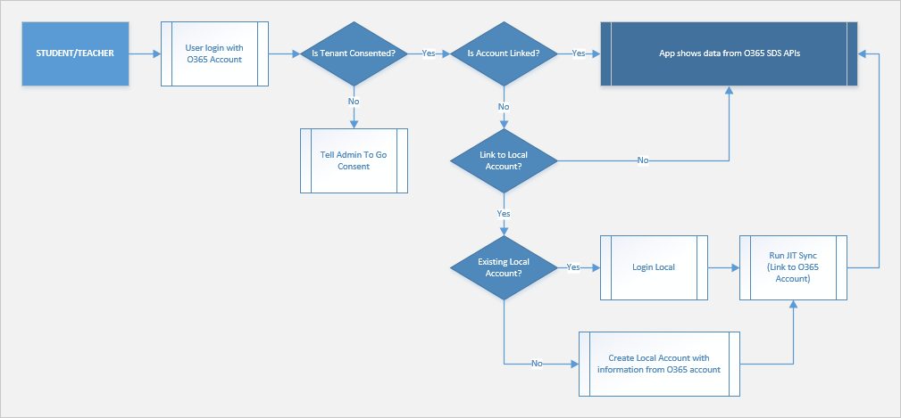

**Admin Login Authentication Flow**

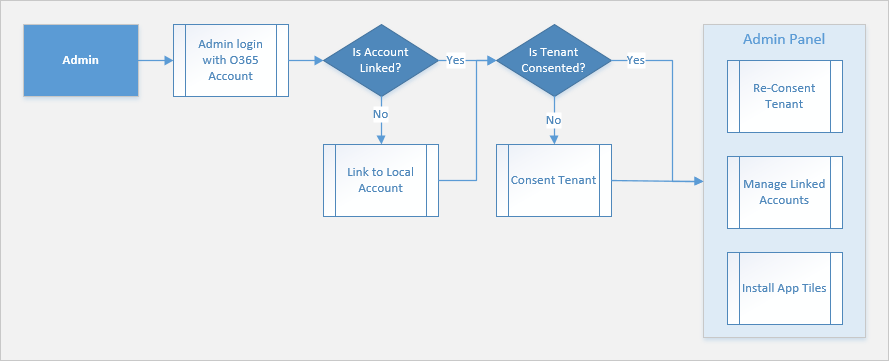

**Application Authentication Flow**

### Two Kinds of Graph API

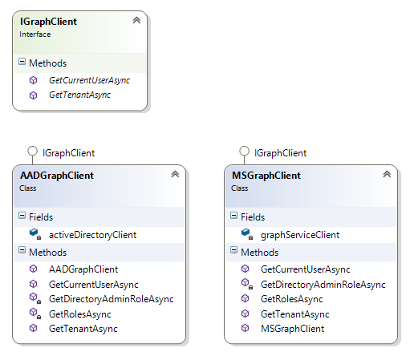

...

### Office 365 Education Data

**EducationServiceClient**

**Get data**

1. Get schools

   Get All schools

2. Get sections

### Differential query

### Other

Multi-tenant application ...

## Contributors
| Roles                                    | Author(s)                                |
| ---------------------------------------- | ---------------------------------------- |
| Project Lead / Architect / Documentation | Todd Baginski (Microsoft MVP, Canviz Consulting) @tbag |
| PM                                       | John Trivedi (Canviz Consulting)         |
| PM                                       | Arthur Zheng (Canviz Consulting)         |
| Developer                                | Tyler Lu (Canviz Consulting) @TylerLu    |
| Developer                                | Benny Zhang (Canviz Consulting)          |
| Testing                                  | Ring Li (Canviz Consulting)              |
| Testing                                  | Melody She (Canviz Consulting)           |
| UX Design                                | Justin So (Canviz Consulting)            |
| Sponsor / Support                        |                                          |
| Sponsor / Support                        |                                          |
| Sponsor / Support                        |                                          |
| Sponsor / Support                        |                                          |

## Version history

| Version | Date         | Comments        |
| ------- | ------------ | --------------- |
| 1.0     | Nov 26, 2016 | Initial release |

## Disclaimer
**THIS CODE IS PROVIDED *AS IS* WITHOUT WARRANTY OF ANY KIND, EITHER EXPRESS OR IMPLIED, INCLUDING ANY IMPLIED WARRANTIES OF FITNESS FOR A PARTICULAR PURPOSE, MERCHANTABILITY, OR NON-INFRINGEMENT.**
