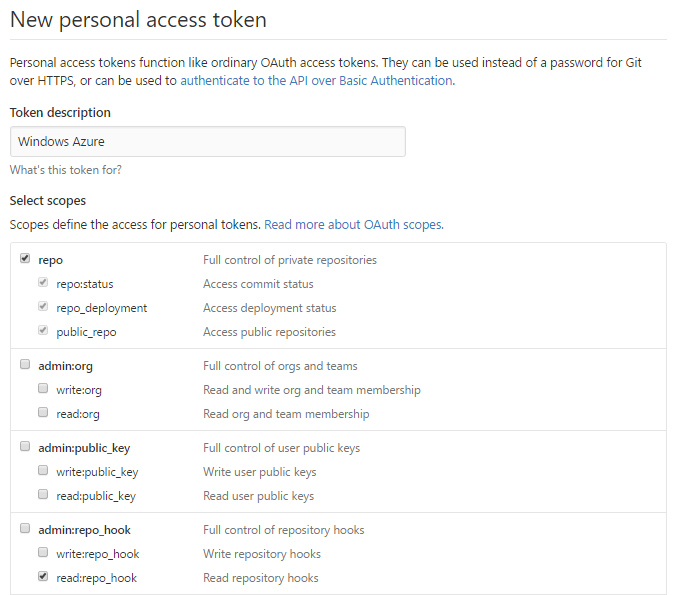
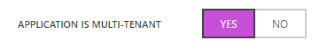
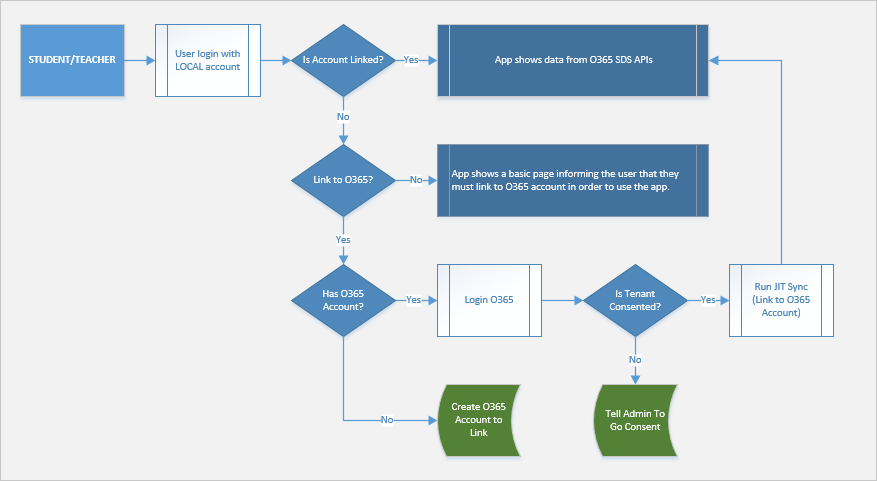
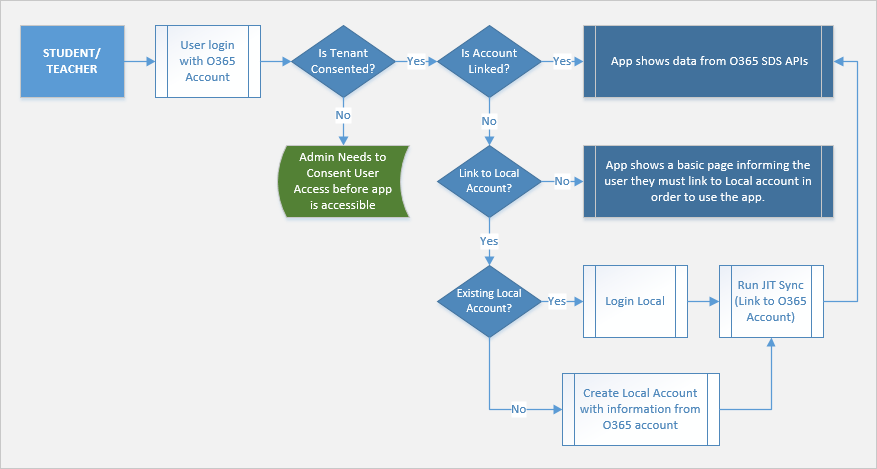
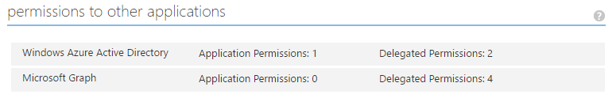

# EDUGraphAPI - Office 365 Education Code Sample#

## What is EDUGraphAPI?##

EDUGraphAPI  is a sample that demonstrates:

* Linking local user accounts and Office 365 user accounts. 
* Calling Graph APIs, including:

  * [Microsoft Azure Active Directory Graph API](https://www.nuget.org/packages/Microsoft.Azure.ActiveDirectory.GraphClient/)
  * [Microsoft Graph API](https://www.nuget.org/packages/Microsoft.Graph/)

  After linking accounts, users can use either local or Office 365 accounts to log into the sample web site and use it.

* Get and show schools/sections/teachers/students from Office 365 Education:

  * [Office 365 Schools REST API reference](https://msdn.microsoft.com/office/office365/api/school-rest-operations)

  A [Differential query](https://msdn.microsoft.com/en-us/library/azure/ad/graph/howto/azure-ad-graph-api-differential-query) is used to sync data that is cached in a local database.

EDUGraphAPI is based on ASP.NET MVC. [ASP.NET Identity](https://www.asp.net/identity) is used in this project.

## How To: Configure your Development Environment

Download and install the following tools to run, build and/or develop this application locally.

- [Visual Studio 2015 Community](https://go.microsoft.com/fwlink/?LinkId=691978&clcid=0x409)

**GitHub Authorization**

1. Generate Token

   - Open https://github.com/settings/tokens in your web browser.
   - Sign into your GitHub account where you forked this repository.
   - Click **Generate Token**
   - Enter a value in the **Token description** text box
   - Select all the **check boxes**

   

   - Click **Generate token**
   - Copy the token

2. Add the GitHub Token to Azure in the Azure Resource Explorer

   - Open https://resources.azure.com/providers/Microsoft.Web/sourcecontrols/GitHub in your web browser.
   - Log in with your Azure account.
   - Selected the correct Azure subscription.
   - Select **Read/Write** mode.
   - Click **Edit**.
   - Paste the token into the **token parameter**.

   

   - Click **PUT**

**Create a key to use the Bing Maps**

1. Open [https://www.bingmapsportal.com/](https://www.bingmapsportal.com/) in your web browser and sign in.

2. Click  **My account** -> **My keys**.

3. Create a **Basic** key, select **Public website** as the application type.

4. Copy the **Key** and save it. 

   

   >**Note:** The key is used in a subsequent step.

**Create an Application in you AAD**

1. Sign into the traditional azure portal: [https://manage.windowsazure.com](https://manage.windowsazure.com).

2. Open the AAD where you plan to create the application.

3. Click **ADD** on the bottom bar.

   

4. Click **Add an application my organization is developing**.

   

5. Input a **Name**, and select **WEB APPLICATION AND/OR WEB API**. 

   

6. Click **➔**.


7. Enter the following values:

   * **SIGN-ON URL:** https://localhost:44311/

   * **APP ID URI:** https://<<YOUR TENANT>>/EDUGraphAPI

   >**Note**: A domain from your tenant must be used here, since this is a multi-tenant application.

   

8. Click the **✓**.

9. Click **CONFIGURE**.

   

10. Enable **APPLICATION IS MULTI-TENANT**.

   

11. Configure the following **permissions to other applications**.

|                                | Application Permissions       | Delegated Permissions                    |
| ------------------------------ | ----------------------------- | ---------------------------------------- |
| Windows Azure Active Directory | Read and write directory data | Sign in and read user profile<br>Read and write directory data |
| Microsoft Graph                | *None*                        | Read all groups<br>Read directory data<br>Access directory as the signed in user<br>Sign user in |

12. In the keys section, click the dropdown list and select a duration, then click **Save**.

   

13. Copy aside the Client ID and the key value.

   


**Deploy the Azure Components**

1. Check to ensure that the build is passing VSTS Build

2. Fork this repository to your GitHub account

3. Click the Deploy to Azure Button

   [](https://portal.azure.com/#create/Microsoft.Template/uri/https%3a%2f%2fraw.githubusercontent.com%2fTylerLu%2fEDUGraphAPI%2fmaster%2fazuredeploy.json)

4. Fill in the values in the deployment page and select the **I agree to the terms and conditions stated above** checkbox.

   

   * **Resource group**: we suggest you to Create a new group.

   * **Site Name**: please input a name. Like EDUGraphAPICanviz or EDUGraphAPI993.

     > Note: If the name you input is taken, you will get some validation errors:
     >
     > 
     >
     > Click it you will get more details, like storage account is already in other resource group/subscription.
     >
     > In this case, please use another name.

   * **Sql Administrator Login Password**: please DO use a strong password.

   * **Source Code Repository URL**: replace <YOUR REPOSITORY> with the repository name of your fork.

   * **Source Code Manual Integration**: choose **false**, since you are deploying from your own fork.

   * **Client Id**: use the Client Id of the AAD Application your created earlier.

   * **Client Secret**: use the Key value of the AAD Application your created earlier.

   * **Bing Map Key**: use the key of Bing Map you got earlier.

   * Check **I agree to the terms and conditions stated above**.

5. Click **Purchase**.

**Add REPLY URL to the AAD Application**

1. After the deployment, open the resource group:

   

2. Click the web app.

   

   Copy the URL aside and change the schema to **https**. This is the replay URL and will be used in next step.

3. Navigate to the AAD application in the traditional azure portal, then click the **Configure** tab.

   Add the reply URL:

   

4. Click **SAVE**.

## Documentation

### Introduction

**EDUGraphAPI.Web**

This web project is based on an ASP.NET MVC application with the **Individual User Accounts** selected. 


The following files were created by the MVC template, and we only change them a little bit.

1. **/App_Start/Startup.Auth.Identity.cs** (The original name is Startup.Auth.cs)
2. **/Controllers/AccountController.cs**

This sample project uses [ASP.NET Identity](https://www.asp.net/identity) and [Owin](https://docs.microsoft.com/en-us/aspnet/core/fundamentals/owin). The 2 technologies make different kinds of authentication coexist easily. Please get familiar them first.

Below are the important class files used in this web project:

| File                              | Description                              |
| --------------------------------- | ---------------------------------------- |
| /App_Start/Startup.Auth.AAD.cs    | Integrates with Azure Active Directory authentication |
| /Controllers/AdminController.cs   | Contains the administrative actions      |
| /Controllers/LinkController.cs    | Contains the actions to link user accounts |
| /Controllers/SchoolsController.cs | Contains the actions to show school data |

**EDUGraphAPI.SyncData**

This is the WebJob used to sync user data.

**EDUGraphAPI.Common**

The class library project is used both the **EDUGraphAPI.Web** and **EDUGraphAPI.Common**. 

The table below shows the folders in the project:

| Folder             | Description                              |
| ------------------ | ---------------------------------------- |
| /Data              | Contains ApplicationDbContext and entity classes |
| /DataSync          | Contains the UserSyncSerextensionsvice class which is used in the EDUGraphAPI.SyncData WebJob |
| /DifferentialQuery | Contains the DifferentialQueryService class which is used to send differential query and parse the result. |
| /Extensions        | Contains lots of extension methods which simplify coding the make code easy to read |
| /Utils             | Contains the wide used class AuthenticationHelper.cs |

**Microsoft.Education**

This project encapsulates the [Schools REST API](https://msdn.microsoft.com/en-us/office/office365/api/school-rest-operations). The most important class in this project is EducationServiceClient.

### Multi-tenant App

This sample is a Multi-tenant App. In the AAD, we enabled the option:


Users from any Azure Active Directory tenant can access this app. As this app uses some application permissions, admin of the tenant should Sign up (consent) first. Otherwise, users would be an error:


For more information, see [Build a multi-tenant SaaS web application using Azure AD & OpenID Connect](https://azure.microsoft.com/en-us/resources/samples/active-directory-dotnet-webapp-multitenant-openidconnect/).

### Data Access and Data Models

ASP.NET Identity uses Entity Framework Code First to implement all of its persistence mechanism. Package [Microsoft.AspNet.Identity.EntityFramework](https://www.nuget.org/packages/Microsoft.AspNet.Identity.EntityFramework/) is created for this. 

In this sample **ApplicationDbContext** is created for access data from a SQL Database. It inherited from **IdentityDbContext** which is defined in the NuGet package mentioned above.

Below are the important Data Models (and their important properties) and used in this sample:

**ApplicationUsers**

Inherited from **IdentityUser**. 

| Property      | Description                              |
| ------------- | ---------------------------------------- |
| Organization  | The tenant of the user. For local unlinked user, its value is null |
| O365UserId    | Used to connection with an Office 365 account |
| O365Email     | The Email of the linked Office 365 account |
| JobTitle      | Used for demonstrating differential query |
| Department    | Used for demonstrating differential query |
| Mobile        | Used for demonstrating differential query |
| FavoriteColor | Used for demonstrating local data        |

**Organizations**

A row in this table represents a tenant in AAD.

| Property         | Description                          |
| ---------------- | ------------------------------------ |
| TenantId         | Guid of the tenant                   |
| Name             | Name of the tenant                   |
| IsAdminConsented | Is the tenant consented by any admin |

### Authentication flows

There are 4 authentication flows in this project.

The first 2 flows (Local/O365 Login) enable users to login in with either a local account or an Office 365 account, then link to the other account. They are implemented in the LinkController.

**Local Login Authentication Flow**



**O365 Login Authentication Flow**



**Admin Login Authentication Flow**

The flow is implemented in AdminController.


**Application Authentication Flow**

This flow in implemented in the SyncData WebJob.


An X509 certification is used. For more details, please check the following links:

* [Daemon or Server Application to Web API](https://docs.microsoft.com/en-us/azure/active-directory/active-directory-authentication-scenarios#daemon-or-server-application-to-web-api)
* [Authenticating to Azure AD in daemon apps with certificates](https://azure.microsoft.com/en-us/resources/samples/active-directory-dotnet-daemon-certificate-credential/)
* [Build service and daemon apps in Office 365](https://msdn.microsoft.com/en-us/office/office365/howto/building-service-apps-in-office-365)

### Two Kinds of Graph API

There are two kinds of Graph API:

|              | [Azure AD Graph API](https://msdn.microsoft.com/en-us/library/azure/ad/graphInstall-Package) | [Microsoft Graph API]([https://graph.microsoft.io/) |
| ------------ | ---------------------------------------- | ---------------------------------------- |
| Description  | The Azure Active Directory Graph API provides programmatic access to Azure Active Directory through REST API endpoints. Apps can use the Azure AD Graph API to perform create, read, update, and delete (CRUD) operations on directory data and directory objects, such as users, groups, and organizational contacts | A unified API that also includes APIs from other Microsoft services like Outlook, OneDrive, OneNote, Planner, and Office Graph, all accessed through a single endpoint with a single access token. |
| Client       | Install-Package [Microsoft.Azure.ActiveDirectory.GraphClient](https://www.nuget.org/packages/Microsoft.Azure.ActiveDirectory.GraphClient/) | Install-Package [Microsoft.Graph](https://www.nuget.org/packages/Microsoft.Graph/) |
| End Point    | https://graph.windows.net                | https://graph.microsoft.com              |
| API Explorer | https://graphexplorer.cloudapp.net/      | https://graph.microsoft.io/graph-explorer |

In this sample, we use the hierarchy below to demonstrate how to use them. 


The **IGraphClient** interface defines two method: GeCurrentUserAsync and GetTenantAsync.

**AADGraphClient** and **MSGraphClient** implement the **IGraphClient** interface with Azure AD Graph and Microsoft Graph client libraries separately.

The interface and the two classes resides in /Services/GraphClients folder of the web app. Some of code is list below to show how to get user and tenant with the 2 kinds of Graph APIs.

**Azure AD Graph** - AADGraphClient.cs

~~~c#
public async Task<UserInfo> GetCurrentUserAsync()
{
    var me = await activeDirectoryClient.Me.ExecuteAsync();
    return new UserInfo
    {
        Id = me.ObjectId,
        GivenName = me.GivenName,
        Surname = me.Surname,
        UserPrincipalName = me.UserPrincipalName,
        Roles = await GetRolesAsync(me)
    };
}
~~~

~~~c#
public async Task<TenantInfo> GetTenantAsync(string tenantId)
{
    var tenant = await activeDirectoryClient.TenantDetails
        .Where(i => i.ObjectId == tenantId)
        .ExecuteSingleAsync();
    return new TenantInfo
    {
        Id = tenant.ObjectId,
        Name = tenant.DisplayName
    };
}

~~~

**Microsoft Graph** - MSGraphClient.cs

~~~c#
public async Task<UserInfo> GetCurrentUserAsync()
{
    var me = await graphServiceClient.Me.Request()
        .Select("id,givenName,surname,userPrincipalName,assignedLicenses")
        .GetAsync();
    return new UserInfo
    {
        Id = me.Id,
        GivenName = me.GivenName,
        Surname = me.Surname,
        UserPrincipalName = me.UserPrincipalName,
        Roles = await GetRolesAsync(me)
    };
}

~~~

~~~c#
public async Task<TenantInfo> GetTenantAsync(string tenantId)
{
    var tenant = await graphServiceClient.Organization[tenantId].Request().GetAsync();
    return new TenantInfo
    {
        Id = tenant.Id,
        Name = tenant.DisplayName
    };
}

~~~

In AAD Application, you should configure permissions for them separately:

 

### Office 365 Education Data

**EducationServiceClient**

[Office 365 Education APIs](https://msdn.microsoft.com/office/office365/api/school-rest-operations) help extract data from your Office 365 tenant which has been synced to the cloud by Microsoft School Data Sync. These results provide information about schools, sections, teachers, students and rosters. The Schools REST API provides access to school entities in Office 365 for Education tenants.

**Get data**

1. Get schools

   You can get all schools, get a single school by its object_id, or get a collection of schools that match a set of query filters.

   Get All schools

   [Get all schools](https://msdn.microsoft.com/office/office365/api/school-rest-operations#get-all-schools) that exist in the Azure Active Directory tenant.

2. Get sections

   You can [get sections](https://msdn.microsoft.com/office/office365/api/school-rest-operations#get-sections-within-a-school) for a specific school by querying for groups based on their school id, using the extension_fe2174665583431c953114ff7268b7b3_Education_ObjectType attribute and the extension_fe2174665583431c953114ff7268b7b3_Education_SyncSource_SchoolId attribute together in the query.

3. Get students within a section

   Students are represented in Azure Active Directory as users. User Extension Attributes add student-specific information. For example, the extension_fe2174665583431c953114ff7268b7b3_Education_Grade attribute contains the student's grade level.

   You can [get students in a specific section](https://msdn.microsoft.com/office/office365/api/section-rest-operations#get-students-within-a-section), by getting the members of the section’s unified group and filtering out non-student users from the resulting collection within your application.


### Differential query

[A differential query](https://msdn.microsoft.com/en-us/Library/Azure/Ad/Graph/howto/azure-ad-graph-api-differential-query) request returns all changes made to specified entities during the time between two consecutive requests. For example, if you make a differential query request an hour after the previous differential query request, only the changes made during that hour will be returned. This functionality is especially useful when synchronizing tenant directory data with an application’s data store.

To make a differential query request to a tenant’s directory, your application must be authorized by the tenant. For more information, see [Integrating Applications with Azure Active Directory](https://azure.microsoft.com/en-us/documentation/articles/active-directory-integrating-applications/).

The related code is in the following two folders of the EDUGraphAPI.Common project:

* **/DifferentialQuery**: contains classes to send differential query and parse differential result.
* **/DataSync**: demonstrates how to sync users.

> Notice: that classes in DifferentialQuery uses some advanced .NET technologies. Please ingore the implementation and just focus on how to use them.

To sync users, we defined the User class:

~~~c#
public class User
{
    public string ObjectId { get; set; }
    public virtual string JobTitle { get; set; }
    public virtual string Department { get; set; }
    public virtual string Mobile { get; set; }
}
~~~

Notice that the changeable properties JobTitle, Department, Mobile are virtual. Classes in DifferentialQuery folder will create a proxy type for User and override these virtual properties for change tracking.

In **UserSyncService**, we demonstrate how to use the  **DifferentialQueryService** to send different query and get different result.

```c#
var differentialQueryService = new DifferentialQueryService(/**/);
DeltaResult<Delta<User>> result = await differentialQueryService.QueryAsync<User>(url);
```
And how to update (or delete) users in local database with the delta result:

~~~c#
foreach (var differentialUser in result.Items)
    await UpdateUserAsync(differentialUser);
//...
private async Task UpdateUserAsync(Delta<User> differentialUser) { /**/ }
~~~

**DataSyncRecord** data model is used to persistent deltaLinks.

Below is the log generated by the SyncData WebJob:

 

### Filters

In the /Infrastructure folder the web project. There are several FilterAttributes.

**EduAuthorizeAttribute**

This is an authorization filter, inherited from AuthorizeAttribute.

It was created because that the web app is configured with multi-authentications and it could not redirect to the correct login page when unauthorized.

We overrided the HandleUnauthorizedRequest method to redirect to /Account/Login:

~~~c#
protected override void HandleUnauthorizedRequest(AuthorizationContext filterContext)
{
    filterContext.Result = new RedirectResult("/Account/Login");
}
~~~

**HandleAdalExceptionAttribute**

The **AuthenticationHelper** expose lots of methods of return access token or instance of a service client. Almost all of these methods invode **[AuthenticationContext.AcquireTokenSilentAsync](https://msdn.microsoft.com/en-us/library/mt473642.aspx)** internally. In most time, **AcquireTokenSilentAsyn** ccould get the access token successfully, as tokens are cached in the database by ADALTokenCache. 

In some case, like the cached token is expired or a new resource token is requested. **AcquireTokenSilentAsyn** will thrown **AdalException**. **HandleAdalExceptionAttribute** was create to handle **AdalException**, and navigate the user to the authentication endpoint to get new tokens.

In some case, we will redirect the user directly to the authentication endpoint by invoking:

~~~c#
filterContext.HttpContext.GetOwinContext().Authentication.Challenge(
   new AuthenticationProperties { RedirectUri = requestUrl },
   OpenIdConnectAuthenticationDefaults.AuthenticationType);
~~~

And in other case, we want to show the user the page blow to tell the user the reason why he got redirected especially for a user logged in with an local account.


We use a switch to controller this. The got the switch value from:

~~~c#
//public static readonly string ChallengeImmediatelyTempDataKey = "ChallengeImmediately";
var challengeImmediately = filterContext.Controller.TempData[ChallengeImmediatelyTempDataKey];
~~~

If the value is true, we will redirect the user to the authentication endpoint immediately. Otherwise, the page above will be shown first, and user click the button to proceed.

**LinkedOrO365UsersOnlyAttribute**

The is another authorization filter. With it we can only allow linked users or Office 365 user to visit the protected resources.

~~~c#
protected override bool AuthorizeCore(HttpContextBase httpContext)
{
    var applicationService = DependencyResolver.Current.GetService<ApplicationService>();
    var user = applicationService.GetUserContext();
    return user.AreAccountsLinked || user.IsO365Account;
}
~~~

For unauthorized user, we will show them the NoAccess page:

~~~c#
protected override void HandleUnauthorizedRequest(AuthorizationContext filterContext)
{
    filterContext.Result = new ViewResult { ViewName = "NoAccess" };
}
~~~

So far, It is only used on the SchoolsController.

## Contributors
| Roles                                    | Author(s)                                |
| ---------------------------------------- | ---------------------------------------- |
| Project Lead / Architect / Documentation | Todd Baginski (Microsoft MVP, Canviz Consulting) @tbag |
| PM                                       | John Trivedi (Canviz Consulting)         |
| Dev Leader                               | Tyler Lu (Canviz Consulting) @TylerLu    |
| Developer                                | Benny Zhang (Canviz Consulting)          |
| Testing                                  | Ring Li (Canviz Consulting)              |
| Testing                                  | Melody She (Canviz Consulting)           |
| UX Design                                | Justin So (Canviz Consulting)            |
| Sponsor / Support                        |                                          |
| Sponsor / Support                        |                                          |
| Sponsor / Support                        |                                          |
| Sponsor / Support                        |                                          |

## Version history

| Version | Date         | Comments        |
| ------- | ------------ | --------------- |
| 1.0     | Nov 26, 2016 | Initial release |

## Disclaimer
**THIS CODE IS PROVIDED *AS IS* WITHOUT WARRANTY OF ANY KIND, EITHER EXPRESS OR IMPLIED, INCLUDING ANY IMPLIED WARRANTIES OF FITNESS FOR A PARTICULAR PURPOSE, MERCHANTABILITY, OR NON-INFRINGEMENT.**
